# Git & GitHub Advanced Workflow Lab

## Project Overview

This project demonstrates advanced Git and GitHub concepts commonly used in real-world software development and DevOps workflows.

The goal of this challenge was to gain hands-on experience with:

* Pull Requests (PRs)
* Git Reset
* Git Revert
* Git Stash
* Git Cherry-Pick
* Git Rebase

All concepts were practiced using a dedicated GitHub repository while documenting commands, screenshots, and outcomes.

---

## Objectives

* Understand collaborative development using Pull Requests.
* Learn different methods of undoing changes safely.
* Save work temporarily using Git Stash.
* Apply specific commits across branches using Cherry-Pick.
* Maintain a clean commit history using Rebase.
* Build confidence with industry-standard Git workflows.

---

## Skills Covered

* Git Branching
* Pull Requests
* GitHub Collaboration
* Commit Management
* Git Reset
* Git Revert
* Git Stash
* Git Cherry-Pick
* Git Rebase
* Conflict Resolution
* Version Control Best Practices

---

## Project Structure

```text
git-github-advanced-workflow-lab
├── screenshots
├── tasks
│   ├── pr-demo.txt
│   ├── reset-demo.txt
│   ├── stash-demo.txt
│   ├── cherry-pick-demo.txt
│   └── rebase-demo.txt
├── solution.md
└── README.md
```

---

# Task 1: Pull Request Workflow

### Activities Performed

* Created a feature branch
* Added changes
* Committed and pushed changes
* Created a Pull Request
* Merged Pull Request into main branch

### Screenshots

#### Project Setup


#### Feature Branch Created


#### Compare Pull Request

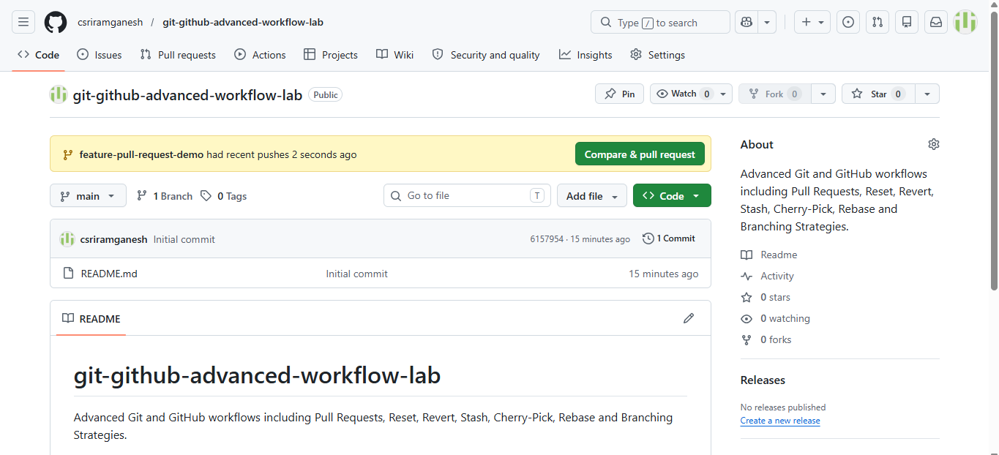

#### Create Pull Request


#### Pull Request Merged

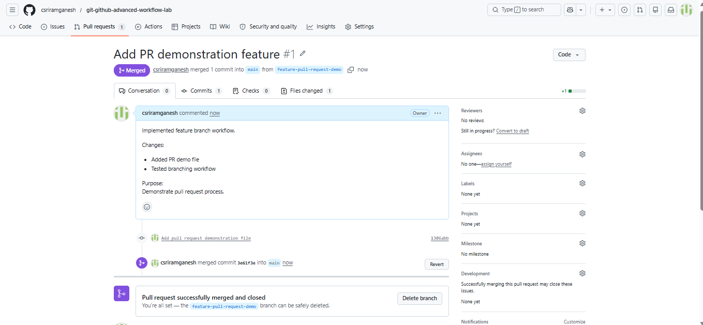

#### GitHub After Merge

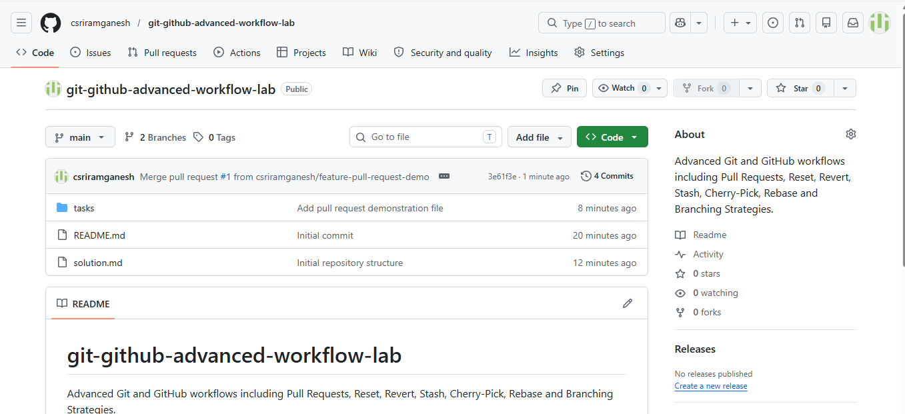

---

# Task 2: Reset & Revert

### Concepts Practiced

* Soft Reset
* Mixed Reset
* Hard Reset
* Revert

### Screenshots

#### Reset Demo File


#### Bad Commit Created


#### Soft Reset


#### Mixed Reset


#### Hard Reset


#### Git Revert


---

# Task 3: Git Stash

### Concepts Practiced

* Saving uncommitted work
* Switching branches safely
* Restoring stashed changes
* Difference between stash pop and stash apply

### Screenshots

#### Stash Demo File


#### Uncommitted Changes

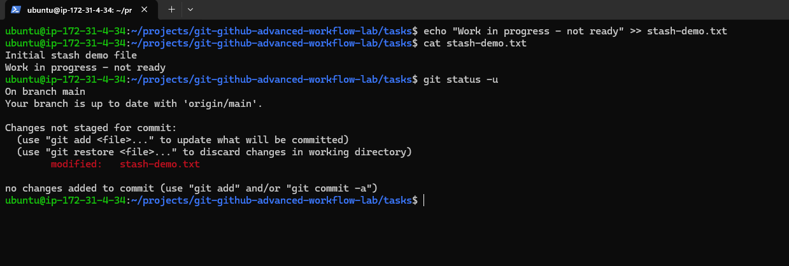

#### Git Stash Created

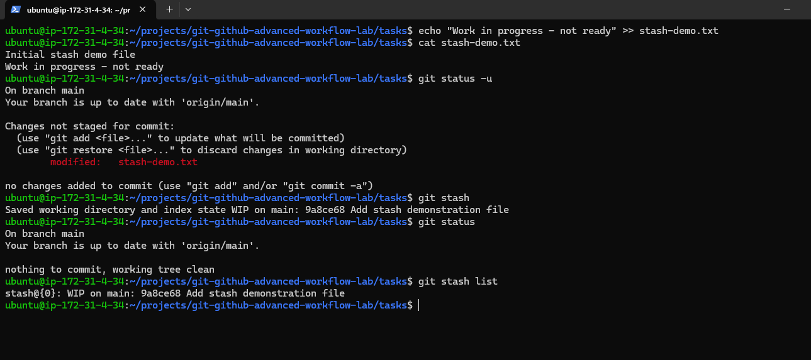

#### Hotfix Branch


#### Stash Pop


#### Stash Apply


#### Cleanup

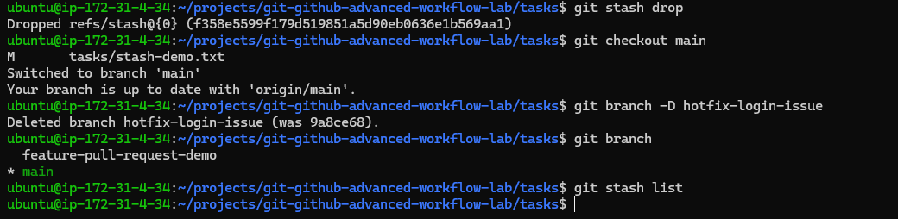

---

# Task 4: Cherry-Picking

### Concepts Practiced

* Creating a bug-fix branch
* Selecting a specific commit
* Applying a commit to another branch

### Screenshots

#### Cherry-Pick Demo File

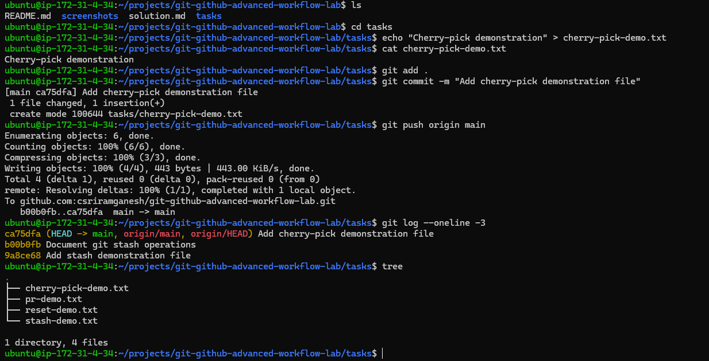

#### Bug Fix Commit

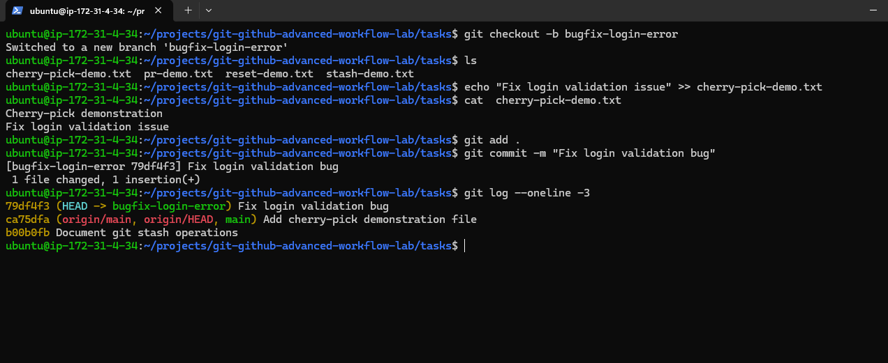

#### Before Cherry Pick

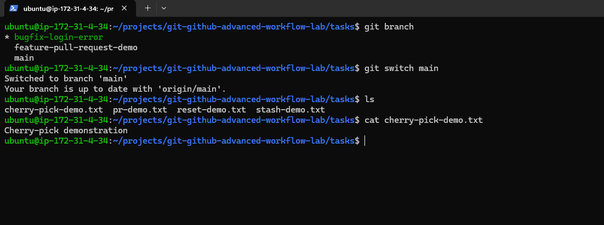

#### Cherry Pick Applied

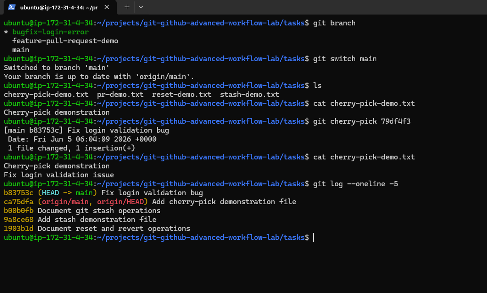

---

# Task 5: Rebasing

### Concepts Practiced

* Updating feature branches
* Rebasing onto main
* Conflict resolution
* Maintaining clean commit history

### Screenshots

#### Rebase Demo File

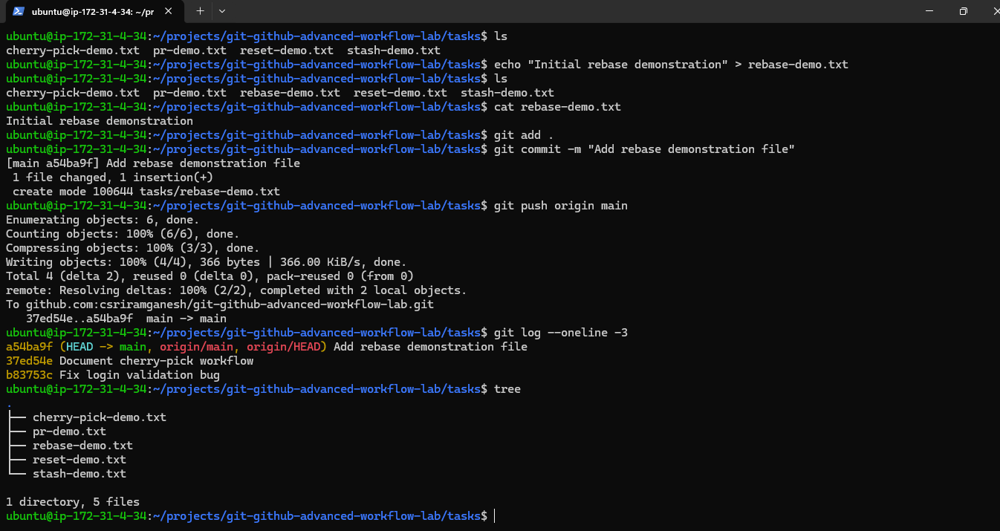

#### Feature Branch Before Rebase

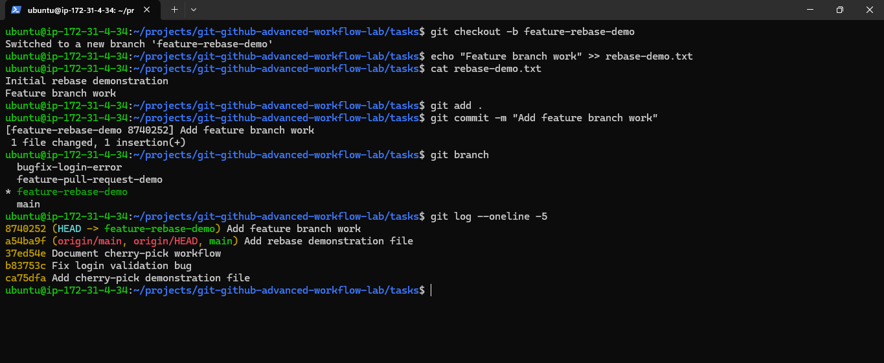

#### Main Branch Update

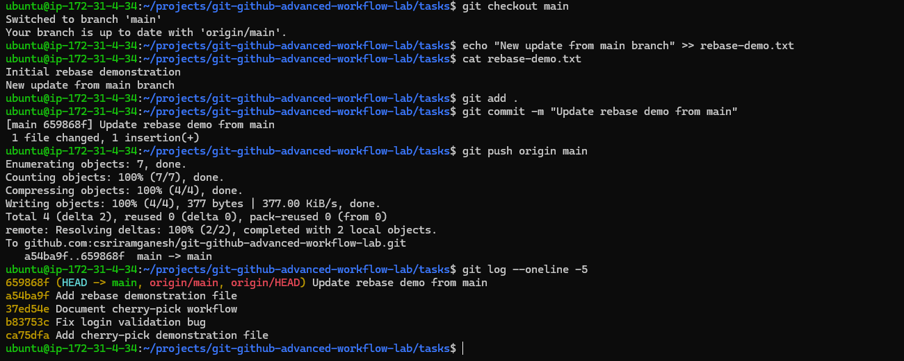

#### Diverged History

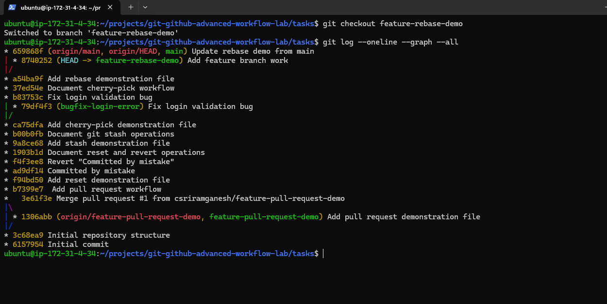

#### Conflict Resolution

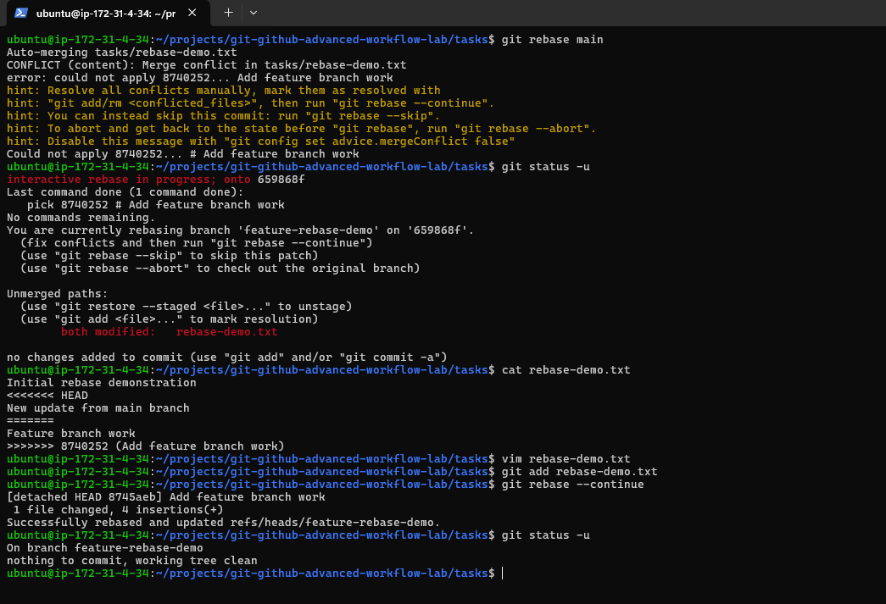

#### Rebase Completed


#### Rebase Verification


---

## Key Learnings

### Pull Requests

* Collaborate safely using feature branches.
* Review code before merging.

### Reset vs Revert

* Reset rewrites history.
* Revert preserves history by creating a new commit.

### Git Stash

* Save unfinished work temporarily.
* Resume work without creating unnecessary commits.

### Cherry-Picking

* Move specific commits between branches.
* Useful for bug fixes and hotfixes.

### Rebasing

* Maintain a linear and clean commit history.
* Avoid unnecessary merge commits.

---

## Common Git Commands Used

```bash
git checkout -b <branch>

git add .

git commit -m "message"

git push origin <branch>

git reset --soft HEAD~1 or Hash Id
 
git reset --mixed HEAD~1 or Hash Id

git reset --hard HEAD~1 or Hash Id

git revert HEAD

git stash

git stash pop

git stash apply

git cherry-pick <commit-id>

git rebase main
```

---

## Real-World Applications

* Team collaboration using Pull Requests
* Production hotfix management
* Code review workflows
* Bug fix backporting
* Clean commit history maintenance
* DevOps and CI/CD development practices

---

## Author

**Sriram Ganesh**

Git & GitHub Advanced Workflow Lab completed as part of the **90 Days of DevOps** challenge.
